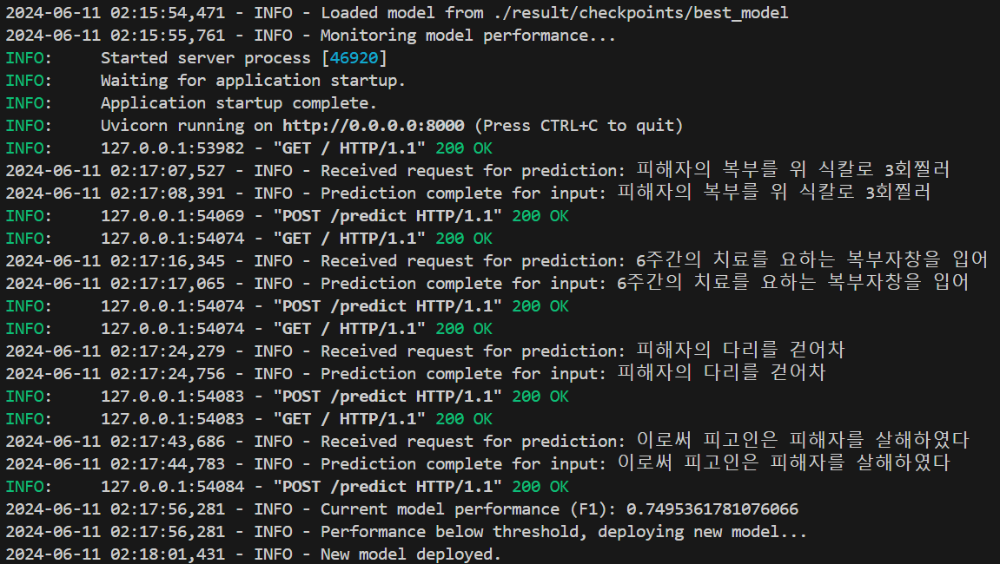

# Text Classification

## Intro
- 이 프로젝트는 문장이 입력되면 범죄 구성요소를 구분하는 텍스트 분류 서비스입니다.
- 문장이 입력되면 범죄 구성요소를 예측하고, top 3의 예측값을 반환합니다(아래 Demo영상 참고).
- 학습, 평가, 추론, 배포, 모니터링 과정을 모두 자동화하였습니다.

## Model
- klue/roberta-base

## Dataset
- 데이터 수: 17999(number of sequence-label pair)
- 데이터 형식: 각 데이터는 `crime_fact`와 `label`로 구성되어 있으며, `crime_fact`는 범죄 사실을 구성하는 문장 리스트이고, `label`은 각 문장과 범죄 구성요소 쌍으로 구성되어있습니다.
- 예시
```json
[
    {
        "crime_fact": [
            "범죄 사실 피고인은 2020.6.29.08:50 경 서울 마포구 B지하 1층에 있는 피해자 C(58세)이 운영하는 'D' 식당에서, 미리 준비한 과도(총길이 22cm. 칼날길이 12cm)를 입고 있던 조끼 주머니에 감춘채",
            "위식당 카운터에 들어가 안쪽에서 영업을 준비하고 있던 피해자에게 '화장실이 어디냐, 니가 사장이냐'라고 묻고 피해자가 바로 대답하지 않자 피해자의 태도가 기분 나쁘다는 이유로",
            "곧바로 과도를 꺼내 피해자의 얼굴을 향해 휘둘렀다.",
            "계속 하여 피고인은 도망하는 피해자를 뒤쫓아가 1층 출입구로 올라가는 계단에서 피해자를 붙잡아 주저앉힌 후",
            "피해자에게 재차 과도를 휘둘러",
            "피해자의 복부를 찌르고 방어하는 피해자의 손과 목 부위를 베어",
            "살해하려고 하였으나 피해자가 몸부림치면서 피고인을 붙잡고 저항하여 그 뜻을 이루지 못하고",
            "미수에 그쳤다."
        ],
        "label": [
            [
                "범죄 사실 피고인은 2020.6.29.08:50 경 서울 마포구 B지하 1층에 있는 피해자 C(58세)이 운영하는 'D' 식당에서, 미리 준비한 과도(총길이 22cm. 칼날길이 12cm)를 입고 있던 조끼 주머니에 감춘채",
                "prep_act"
            ],
            [
                "위식당 카운터에 들어가 안쪽에서 영업을 준비하고 있던 피해자에게 '화장실이 어디냐, 니가 사장이냐'라고 묻고 피해자가 바로 대답하지 않자 피해자의 태도가 기분 나쁘다는 이유로",
                "motive"
            ],
            [
                "곧바로 과도를 꺼내 피해자의 얼굴을 향해 휘둘렀다.",
                "nan"
            ],
            [
                "계속 하여 피고인은 도망하는 피해자를 뒤쫓아가 1층 출입구로 올라가는 계단에서 피해자를 붙잡아 주저앉힌 후",
                "crime_method"
            ],
            [
                "피해자에게 재차 과도를 휘둘러",
                "crime_method"
            ],
            [
                "피해자의 복부를 찌르고 방어하는 피해자의 손과 목 부위를 베어",
                "crime_method"
            ],
            [
                "살해하려고 하였으나 피해자가 몸부림치면서 피고인을 붙잡고 저항하여 그 뜻을 이루지 못하고",
                "reason_incmpl"
            ],
            [
                "미수에 그쳤다.",
                "crime_result"
            ]
        ]
    }
]
```

- 라벨

| 라벨            | 설명               |
| --------------- | ------------------ |
| a_med_rec       | 피의자 병력        |
| a_eco_bg        | 피의자 경제상황    |
| a_crim_rec      | 피의자 범죄전력    |
| prep_act        | 범행도구 준비      |
| a_mental_con    | 술 및 약물 복용 여부|
| motive          | 범행동기           |
| crime_method    | 범행방법(공격행위) |
| reason_incmpl   | 미수원인           |
| v_injury        | 피해자 상해        |
| crime_result    | 범행결과           |
| nan             | 해당없음           |

## 실행방법
- 전체 파이프라인을 실행하려면 pipeline.bat 파일을 실행합니다.
- 파이프라인을 실행하면 가상 환경을 활성화하고, 필요한 패키지를 설치한 후, 모델을 학습 및 평가하고, 추론 서버를 시작합니다.


```bat
@echo off
echo Activating the virtual environment...
call conda activate myenv

echo Installing necessary packages...
pip install -r requirements.txt

echo Training and evaluating the model...
python finetune.py

echo Starting the inference server...
python inference.py
```



## Demo Video
[](https://www.youtube.com/watch?v=3Wufk3Gj1nc)
