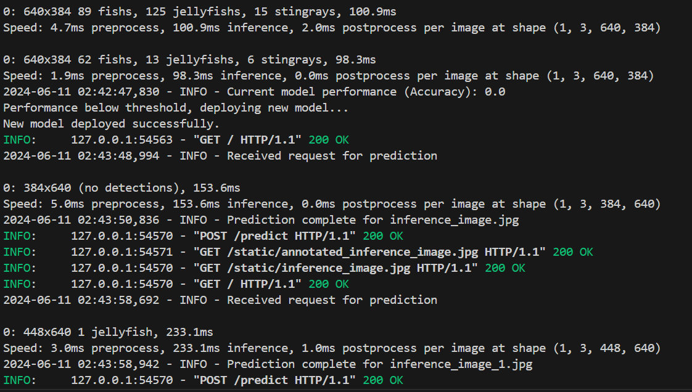

# Object Detection

## Intro
- 이 프로젝트는 이미지가 입력되면 수중 생물체를 인식하는 객체 탐지 서비스입니다.
- 학습, 평가, 추론, 배포, 모니터링 과정을 모두 자동화하였습니다.

## Model
- yolov8n(nano model)

## Dataset

- Aquarium Combined.v2-raw-1024.yolov8
  - https://universe.roboflow.com/brad-dwyer/aquarium-combined

- Provided by [Roboflow](https://roboflow.com)
  - License: CC BY 4.0

- Dataset Details
  - This dataset consists of 638 images collected by Roboflow from two aquariums in the United States: The Henry Doorly Zoo in Omaha (October 16, 2020) and the National Aquarium in Baltimore (November 14, 2020). The images were labeled for object detection by the Roboflow team (with some help from SageMaker Ground Truth). Images and annotations are released under a Creative Commons By-Attribution license. 

- 라벨
  - number of class: 7
  - names: ['fish', 'jellyfish', 'penguin', 'puffin', 'shark', 'starfish', 'stingray']


## 실행방법
- 전체 파이프라인을 실행하려면 pipeline.bat 파일을 실행합니다.
- 파이프라인을 실행하면 가상 환경을 활성화하고, 필요한 패키지를 설치한 후, 모델을 학습 및 평가하고, 추론 서버를 시작합니다.


```bat
@echo off
echo Activating the virtual environment...
call conda activate myenv

echo Installing necessary packages...
pip install -r requirements.txt

echo Training and evaluating the model...
python finetune.py

echo Starting the inference server...
python inference.py
```



## Demo Video
[](https://youtu.be/ZBri6iUfVY8)
